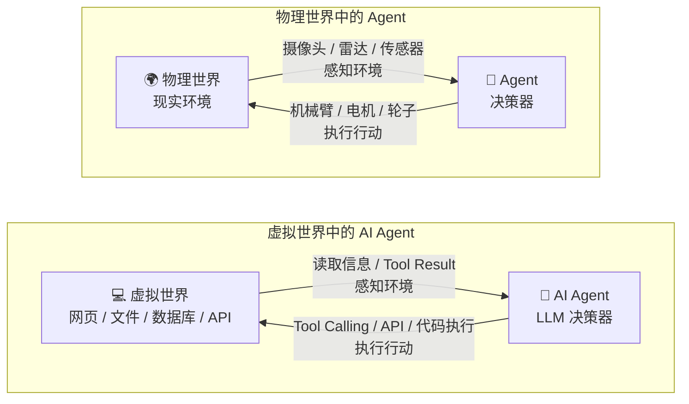

<div class="content-zh" markdown="1">
# 第二章：大模型基础

## 2.1 什么是 AI Agent

> **Agent（智能体）是一个能够感知环境，并根据所感知到的信息采取行动，从而影响环境、实现某种目标的实体。**

这个定义来自 AI 领域非常经典的“智能体”观点。2023 年一篇大型 LLM-Agent 综述仍然把 AI Agent 概括为能够感知环境（sense）、做出决策（make decisions）、采取行动（take actions）的人工实体[[arXiv](https://arxiv.org/abs/2309.07864?utm_source=chatgpt.com)]。

**可以它压缩成三个关键词：Agent = 环境感知器 + 决策器 + 行动执行器。**

在机器人领域中，感知器一般是摄像头，探测仪等；决策器是内置的处理程序；执行器则是机器臂等。而在 AI Agent 中，“感知器”通常是各种输入接口和工具返回的信息；“决策器”通常由 LLM 及其规划、状态和策略机制构成；“执行器”则通常是 Agent 可以调用的工具、API 或函数。。不管是机器人的实体 Agent还是现在AI的虚拟Agent，实现方式可以不同，但“感知 → 决策 → 行动”这个基本结构不变。

| 组成部分   | 机器人中的例子       | AI Agent 中的例子                           | 作用                     |
| ---------- | -------------------- | ------------------------------------------- | ------------------------ |
| **感知器** | 摄像头、雷达、传感器 | 用户输入、网页、文件、数据库、API 返回结果  | 获取环境信息             |
| **决策器** | 控制程序、规划算法   | 大语言模型（LLM）及相关规划逻辑             | 分析信息并决定下一步行动 |
| **执行器** | 机械臂、电机、轮子   | Tools、Function Calling、API 调用、代码执行 | 执行行动并影响环境       |



## 2.2 Chatbot、Workflow 与 Agent 的区别

**Workflow 与Agent**

一句话：Workflow 是“按照预先规定好的步骤执行”，Agent 是“给定目标后，自主决定下一步做什么”。

| 对比               | Workflow                      | Agent                              |
| ------------------ | ----------------------------- | ---------------------------------- |
| **核心特点**       | 流程预先定义                  | 根据目标动态决策                   |
| **执行路径**       | 基本固定                      | 可以动态变化                       |
| **下一步由谁决定** | 开发者预先写好                | Agent 根据当前状态决定             |
| **适合场景**       | 稳定、重复、规则明确的任务    | 开放、复杂、路径不确定的任务       |
| **例子**           | 收到订单 → 校验 → 扣款 → 发货 | “帮我找到最合适的供应商并比较方案” |

**Chatbot与Agent**

一句话：Chatbot 主要是在“说”，Agent 主要是在“做”。

| 对比                     | Chatbot                  | Agent                    |
| ------------------------ | ------------------------ | ------------------------ |
| **主要目的**             | 与用户对话、回答问题     | 完成一个目标或任务       |
| **主要输出**             | 文本回答                 | 行动 + 结果              |
| **是否必须操作外部环境** | 不需要                   | 通常会                   |
| **是否持续决策**         | 通常一问一答             | 经常进行多轮决策         |
| **是否使用工具**         | 可以使用，但不是必要条件 | Tools 通常是核心能力     |
| **例子**                 | “解释一下什么是机器学习” | “分析这份数据并生成报告” |

## 2.3 Agent 的基本循环(Agent 的智能机制)

```text
目标
→ Planning 理解任务，制定计划
→ Action 选择行动，调用工具
→ Evaluator 获取结果，评估结果，继续决策或结束任务
```

### 1. Planning

**Planning 负责决定一个复杂目标应该如何完成。**

简单任务可能只需要一次推理。

复杂任务通常需要多个步骤。

**Task Decomposition：**Planning 的第一个重要能力是：任务拆解。即把一个复杂目标拆成多个可以执行的子任务。

**Replanning：**现实任务通常不会完全按照最初计划执行。因此 Agent 不只是 Planning，还需要：Replanning（重新规划）

**静态计划与动态计划：**

静态计划：先制定完整计划，按照计划逐步执行

动态计划：执行一步，观察结果，决定下一步，继续执行

现代 Agent 通常更强调动态规划。

### 2. Action


### 3. Evaluator

**Evaluator 用来判断 Agent 做得是否正确，以及任务是否应该继续。**

它可以检查：是否完成目标、答案是否正确、工具调用是否正确、是否遗漏关键步骤、执行路径是否合理、是否需要重新执行、是否应该停止。因此 Evaluator 可以理解为 Agent 的：质量检查机制。

Evaluator 不一定是一个独立模块。它可以由不同机制实现。

例如：

**规则检查：**有固定的检查程序

**LLM Judge：**让另一个模型检查结果：

**Self-Evaluation：**由 Agent 自己检查：

**Human Evaluation：**人工确认

## 2.4 Agent 的核心组件

一个现代 AI Agent 并不只是一个大语言模型，而是由多个模块共同组成的智能系统。从工程角度，可以将一个较完整的 Agent 抽象为：

**Agent = Model + Tools + Memory + Environment **这些组件分别负责思考、约束、行动、记忆、规划、交互和评估。

### 1. Model

**Model 是 Agent 的核心推理与决策引擎。**在现代 LLM Agent 中，Model 通常指大语言模型，例如 GPT、Claude、Gemini、Llama 等。

模型主要负责：理解用户输入、理解当前任务目标、分析环境信息、进行推理和判断、决定下一步行动、选择是否调用工具、生成最终结果。因此可以将 Model 理解为 Agent 的大脑。

### 2. Tools

**Tools 是 Agent 与外部世界交互的重要手段。**

大语言模型本身通常只能处理输入并生成输出。如果 Agent 想获取最新信息、执行计算或修改外部系统，就需要使用 Tools。

常见 Tools 包括：

- **Function Tools**：由开发者直接定义的函数或 API 接口，例如搜索、查询数据库、计算、发送邮件、执行代码等；模型根据工具的名称、描述和参数决定何时调用。
- **Skill**：面向某类任务封装的一组能力、规则和操作流程，通常会组合多个 Tools，并规定如何使用这些工具完成一个较完整的任务。
- **MCP（Model Context Protocol）**：一种标准化协议，用来让 Agent 连接外部数据源、工具和服务，使不同模型或 Agent 可以用统一方式发现和调用外部能力。

因此可以理解为：Model 负责决定“做什么”，Tools 负责真正“去做”。

### 3. Memory

**Memory 负责保存 Agent 在执行任务过程中需要持续使用的信息。**

如果没有 Memory，Agent 每次执行都可能像“第一次见到用户”。

Memory 可以让 Agent 记住：用户偏好、历史对话、当前任务状态、已经完成的步骤、已经获得的信息、历史经验

**短期记忆：**Short-Term Memory 通常保存当前任务所需要的信息。生命周期通常只持续当前任务或当前会话。

**长期记忆**：Long-Term Memory 用来保存跨任务的信息。这些信息以后仍然可能被使用。

**Memory 的基本流程：**Memory 通常涉及三个操作：Write写入记忆，Read读取记忆，Update更新记忆。因此 Memory 并不是简单地“保存聊天记录”，而是一套信息管理机制。

### 4. Environment

**Environment 是 Agent 所处并与之交互的外部世界。**

Environment 可以是现实世界，也可以是数字世界。

对于 AI Agent：

```
Environment=浏览器、文件系统、数据库、操作系统、企业软件、互联网、API
```

#### Environment State

环境并不是静态的。Agent 需要观察环境这些变化，并据此调整决策。

因此 Agent 的基本循环可以表示为：

```
Observe Environment
        ↓
Make Decision
        ↓
Take Action
        ↓
Environment Changes
        ↓
Observe Again
```


## Agent 核心组件之间的关系

可以把整个 Agent 系统理解为：

```

```
