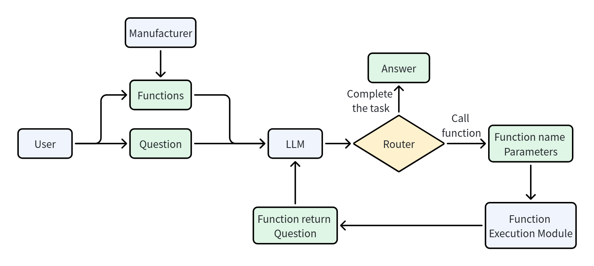

# 第五章：Tool Calling

特别鸣谢：B站：堂吉诃德拉曼查的英豪，ChatGPT

在 Agent 系统中，Tool Calling 要解决的核心问题是：**如何让大模型从“只会生成文字”，变成“能够触发外部工具执行任务”。**

传统聊天大模型本身并不直接连接外部世界。它可以理解用户的问题、生成自然语言回答、进行推理和总结，但它不能天然感知环境，也不能天然改变环境。比如用户问“广州今天的天气怎么样？适合出门吗？”，如果模型只依赖自身知识，它并不知道今天广州的实时天气；如果用户说“帮我发一封邮件给张三”，模型可以写出邮件内容，但它不会真的把邮件发送出去。

因此，大模型在没有工具调用能力时，主要存在两个限制：

第一，**无法感知环境**。模型无法主动访问外部数据源，比如实时天气 API、搜索引擎、企业数据库、用户本地文件、远程知识库等。它的回答只能依赖训练时学到的知识和当前上下文中已有的信息。

第二，**无法改变环境**。模型无法直接执行真实动作，比如运行代码、发送邮件、创建日程、上传文件、查询订单、修改数据库记录等。它可以告诉用户“你可以这样做”，但不能替用户真正完成操作。

Tool Calling 的出现，就是一种让模型连接外部系统、访问训练数据之外信息的方式。

## 1. Function Calling

**Function Calling 是最基础的工具调用方式，也是最底层、最基础的工具调用机制**。指的是一种让大模型根据用户输入，自动选择函数并生成结构化调用参数的机制。它的基本思想是：开发者先把可用函数的名称、用途说明、参数结构告诉大模型；当用户提出问题时，大模型根据上下文判断是否需要调用某个函数。如果需要，模型不会直接返回普通文本，而是返回一个结构化的函数调用请求，**大模型通常并不真正执行函数**。它只是告诉外部程序：“我要调用这个函数，并且参数是这些。”真正执行函数的是 AI 应用程序的后端、Agent 框架或模型服务商提供的工具运行环境。

Google Gemini 的官方文档也采用类似定义：Function Calling 可以把模型连接到外部工具和 API，使模型判断何时调用特定函数，并提供执行真实动作所需的参数。 Anthropic 的 Claude 文档也说明，工具使用流程通常是模型根据用户请求和工具描述决定是否调用工具，然后返回结构化调用，由应用程序执行。OpenAI 当前文档也将 Function Calling 视为 Tool Calling 的一种形式，并将函数定义为一种由 JSON Schema 描述的工具。

### 1.1 Function Calling 的工作原理

{: .w-75 }

- Function Calling 的工作流程

  ```text
  用户提出需求
  → 应用程序把用户消息和工具定义发给模型
  → 模型判断是否需要调用工具
  → 模型返回函数名和参数
  → 后端校验并执行真实函数
  → 后端把函数执行结果返回给模型
  → 模型根据结果继续调用工具或生成最终回答
  ```

### 1.2 Function Calling 的组成部分

定义一个完整的 Function Calling，不能只写一段函数描述。它实际上包含两个层面：模型可见的工具契约 + 后端可执行的函数实现。模型可见的工具契约告诉大模型“有什么工具以及应该怎样调用”；后端实现则负责“真正完成这项工作”。一个完整的 Function Calling 系统通常包含以下部分：

| 组成部分               | 作用                               |
| :--------------------: | :--------------------------------: |
| 函数名称 `name`        | 让模型识别和选择函数               |
| 函数描述 `description` | 告诉模型函数的用途、适用场景和限制 |
| 参数结构 `parameters`  | 规定参数名称、类型、含义和必填项   |
| 函数实现               | 真正查询数据或执行操作的后端代码   |
| 工具注册与分发器       | 根据模型返回的函数名找到对应实现   |
| 参数校验与权限控制     | 防止错误参数、越权调用和高风险操作 |
| 工具结果               | 将执行结果或错误信息返回给模型     |
| 调用循环               | 决定继续调用工具还是生成最终回答   |

其中，提供给模型的通常是前三项，后面的执行和安全逻辑由应用程序负责。

#### 函数名称

函数名称应该清楚表达动作和对象，通常采用“动词 + 名词”的形式：

```text
get_weather
search_documents
send_email
create_calendar_event
update_customer_record
```

不建议使用含义模糊的名称：

```text
do_task
process
handle
tool_1
```

因为模型会把函数名称作为工具选择的重要依据。名称越明确，模型越容易在多个工具之间作出正确选择。

#### 函数描述

函数描述不是普通的代码注释，而是模型选择工具时的重要决策依据。一个好的描述应该说明：

- 函数能做什么
- 什么时候应该调用
- 什么时候不应该调用
- 返回什么信息
- 有哪些限制

例如，不建议只写：

```json
{
  "description": "查询天气"
}
```

更合理的描述是：

```json
{
  "description": "查询指定城市在指定日期的天气情况。适用于用户询问气温、降雨、是否需要带伞、穿衣建议或是否适合户外活动的场景。不用于查询历史气候统计。"
}
```

Anthropic 的工具定义指南特别强调，详细描述是影响工具调用效果的重要因素，描述中应说明工具用途、适用与不适用场景、各参数含义以及重要限制。

#### 参数结构

参数通常使用 JSON Schema 描述，包括：参数名称，参数类型，参数描述，是否必填，可选值范围，是否允许额外字段

例如：

```json
{
  "type": "function",
  "name": "get_weather",
  "description": "查询指定城市在指定日期的天气情况。",
  "parameters": {
    "type": "object",
    "properties": {
      "city": {
        "type": "string",
        "description": "城市名称，例如广州、北京或上海"
      },
      "date": {
        "type": "string",
        "description": "查询日期，格式为 YYYY-MM-DD"
      },
      "unit": {
        "type": "string",
        "enum": ["celsius", "fahrenheit"],
        "description": "温度单位"
      }
    },
    "required": ["city", "date", "unit"],
    "additionalProperties": false
  },
  "strict": true
}
```

这里各字段的含义是：

- `type: "function"`：声明这是一个函数工具。
- `name`：函数名称。
- `description`：函数的用途和调用条件。
- `parameters`：函数参数的 JSON Schema。
- `properties`：定义各个参数。
- `required`：列出必填参数。
- `enum`：限制参数只能取指定值。
- `additionalProperties: false`：禁止模型生成未定义参数。
- `strict: true`：要求模型生成的参数严格遵守 Schema。

OpenAI 当前的 Function Calling 接口将函数作为一种 tool，核心定义字段为 `type`、`name`、`description`、`parameters` 和 `strict`。在严格模式下，函数参数能更可靠地遵循 Schema；但后端仍然需要进行业务校验和权限校验。

不同模型厂商的具体字段略有区别。例如 OpenAI 常用 `parameters`，Anthropic 使用 `input_schema`，Gemini 也通过函数声明和参数 Schema 描述工具，但它们的核心思想基本一致：**函数名负责识别，描述负责选择，Schema 负责约束参数。**

#### 后端函数实现

工具定义只是告诉模型如何提出调用请求，还必须有真正可执行的代码：

```python
def get_weather(city: str, date: str, unit: str) -> dict:
    # 实际项目中，这里会调用天气 API
    return {
        "city": city,
        "date": date,
        "unit": unit,
        "temperature": 35,
        "condition": "暴雨"
    }
```

通常还会建立一个工具注册表：

```python
TOOL_REGISTRY = {
    "get_weather": get_weather
}
```

当模型返回函数名时，后端通过注册表找到对应函数：

```python
function_name = tool_call["name"]
arguments = tool_call["arguments"]

function = TOOL_REGISTRY.get(function_name)

if function is None:
    raise ValueError(f"不存在的工具：{function_name}")

result = function(**arguments)
```

因此，定义 Function Calling 时需要区分两个经常被混淆的概念：

```text
工具定义：写给模型看，帮助模型选择和填写参数
函数实现：写给程序运行，真正访问数据或执行动作
```

模型通常只能看到工具定义，看不到函数源码、数据库密码或第三方 API 密钥。

#### 基于提示词的 Function Calling

基于提示词的 Function Calling，是指不使用模型厂商提供的原生工具调用接口，而是在 Prompt 中人为约定函数列表和输出格式，让模型用文本生成函数调用指令。

例如：

```text
# 角色

你是一个函数调用助手。请根据用户的请求判断是否需要调用函数。

# 可用函数

1. get_weather
作用：查询指定城市的天气。
参数：
- city：string，城市名称
- date：string，查询日期

2. get_time
作用：查询指定城市的当前时间。
参数：
- city：string，城市名称

# 输出规则

需要调用函数时，只能输出以下 JSON：

{
  "name": "函数名",
  "arguments": {
    "参数名": "参数值"
  }
}

不需要调用函数时，输出：

{
  "name": null,
  "arguments": {}
}
```

用户输入：

```text
广州今天需要带伞吗？
```

模型预期输出：

```json
{
  "name": "get_weather",
  "arguments": {
    "city": "广州",
    "date": "今天"
  }
}
```

后端再解析这段文本，并执行对应函数：

```python
import json

model_output = """
{
  "name": "get_weather",
  "arguments": {
    "city": "广州",
    "date": "今天"
  }
}
"""

tool_call = json.loads(model_output)

function = TOOL_REGISTRY[tool_call["name"]]
result = function(**tool_call["arguments"])
```

**优点：**

实现简单、兼容性强

**缺点：**

第一，输出格式不稳定。模型可能在 JSON 前后加入解释文字，甚至生成无法解析的 JSON。

第二，缺少强约束。模型可能编造不存在的函数名、参数名或参数类型。

第三，解析逻辑由开发者维护。开发者需要自行处理代码块、自然语言、非法 JSON 和各种边界情况。

第四，Prompt 会不断膨胀。工具越多，需要放入上下文的函数说明和规则越多，增加选择难度。

因此，基于提示词的方案更准确地说是“用文本模拟 Function Calling”。OpenAI 的提示指南也建议，在模型原生支持工具调用时，应优先通过 API 的 `tools` 字段传入工具，而不是手动把工具 Schema 注入 Prompt 并自行编写解析器。

#### 基于 API 的 Function Calling

基于 API 的 Function Calling，是指模型厂商在模型能力和 API 协议层面直接支持工具调用。开发者通过专门的 `tools` 字段提供工具定义，模型通过专门的结构化字段返回函数调用，而不是把调用指令混在普通自然语言中。

以 OpenAI Responses API 风格为例，首先定义工具：

```python
tools = [
    {
        "type": "function",
        "name": "get_weather",
        "description": (
            "查询指定城市在指定日期的天气情况。"
            "适用于天气、降雨、带伞和户外活动建议。"
        ),
        "parameters": {
            "type": "object",
            "properties": {
                "city": {
                    "type": "string",
                    "description": "城市名称，例如广州"
                },
                "date": {
                    "type": "string",
                    "description": "日期，格式为 YYYY-MM-DD"
                }
            },
            "required": ["city", "date"],
            "additionalProperties": False
        },
        "strict": True
    }
]
```

然后将用户问题和工具定义一起发送给模型：

```python
from openai import OpenAI

client = OpenAI()

response = client.responses.create(
    model="YOUR_MODEL",
    input="广州今天的天气怎么样，适合出门吗？",
    tools=tools
)
```

如果模型决定调用工具，它会返回结构化的函数调用对象，其中包含函数名、参数和调用标识：

```json
{
  "type": "function_call",
  "call_id": "call_001",
  "name": "get_weather",
  "arguments": "{\"city\":\"广州\",\"date\":\"2026-07-11\"}"
}
```

应用程序解析参数并执行函数：

```python
import json

tool_outputs = []

for item in response.output:
    if item.type != "function_call":
        continue

    arguments = json.loads(item.arguments)

    if item.name == "get_weather":
        result = get_weather(**arguments)

        tool_outputs.append({
            "type": "function_call_output",
            "call_id": item.call_id,
            "output": json.dumps(result, ensure_ascii=False)
        })
```

最后，把工具结果返回给模型：

```python
final_response = client.responses.create(
    model="YOUR_MODEL",
    input=response.output + tool_outputs,
    tools=tools
)

print(final_response.output_text)
```

模型根据工具结果生成最终回答：

```text
广州今天有暴雨，气温较高，不太适合长时间户外活动。
必须外出时建议携带雨具，并留意交通和积水情况。
```

**优点：**

函数定义与普通 Prompt 分离

模型返回专门的结构化调用对象

函数名和参数更容易解析

可以使用严格 Schema 约束

能够通过 `call_id` 关联调用与结果

更容易支持多轮和多个工具调用

从工程角度看，基于 API 的 Function Calling 可以理解为：**模型负责生成带类型约束的动作建议，后端负责决定该动作是否允许以及如何安全执行。**
