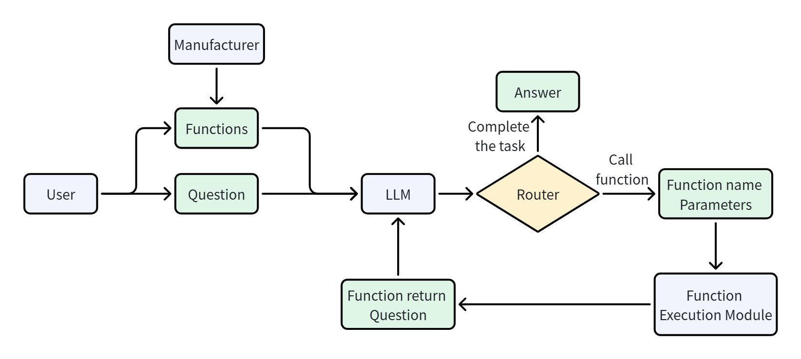

<div class="content-zh" markdown="1">

# 第五章：Tool Calling

特别鸣谢：B站：堂吉诃德拉曼查的英豪，ChatGPT

在 Agent 系统中，Tool Calling 要解决的核心问题是：**如何让大模型从"只会生成文字"，变成"能够触发外部工具执行任务"。**

传统聊天大模型本身并不直接连接外部世界。它可以理解用户的问题、生成自然语言回答、进行推理和总结，但它不能天然感知环境，也不能天然改变环境。比如用户问"广州今天的天气怎么样？适合出门吗？"，如果模型只依赖自身知识，它并不知道今天广州的实时天气；如果用户说"帮我发一封邮件给张三"，模型可以写出邮件内容，但它不会真的把邮件发送出去。

因此，大模型在没有工具调用能力时，主要存在两个限制：

第一，**无法感知环境**。模型无法主动访问外部数据源，比如实时天气 API、搜索引擎、企业数据库、用户本地文件、远程知识库等。它的回答只能依赖训练时学到的知识和当前上下文中已有的信息。

第二，**无法改变环境**。模型无法直接执行真实动作，比如运行代码、发送邮件、创建日程、上传文件、查询订单、修改数据库记录等。它可以告诉用户"你可以这样做"，但不能替用户真正完成操作。

Tool Calling 的出现，就是一种让模型连接外部系统、访问训练数据之外信息的方式。

## 1. Function Calling

**Function Calling 是最基础的工具调用方式，也是最底层、最基础的工具调用机制**。指的是一种让大模型根据用户输入，自动选择函数并生成结构化调用参数的机制。它的基本思想是：开发者先把可用函数的名称、用途说明、参数结构告诉大模型；当用户提出问题时，大模型根据上下文判断是否需要调用某个函数。如果需要，模型不会直接返回普通文本，而是返回一个结构化的函数调用请求，**大模型通常并不真正执行函数**。它只是告诉外部程序："我要调用这个函数，并且参数是这些。"真正执行函数的是 AI 应用程序的后端、Agent 框架或模型服务商提供的工具运行环境。

Google Gemini 的官方文档也采用类似定义：Function Calling 可以把模型连接到外部工具和 API，使模型判断何时调用特定函数，并提供执行真实动作所需的参数。 Anthropic 的 Claude 文档也说明，工具使用流程通常是模型根据用户请求和工具描述决定是否调用工具，然后返回结构化调用，由应用程序执行。OpenAI 当前文档也将 Function Calling 视为 Tool Calling 的一种形式，并将函数定义为一种由 JSON Schema 描述的工具。

### 1.1 Function Calling 的工作原理

{: .w-75 }

- Function Calling 的工作流程

  ```text
  用户提出需求
  → 应用程序把用户消息和工具定义发给模型
  → 模型判断是否需要调用工具
  → 模型返回函数名和参数
  → 后端校验并执行真实函数
  → 后端把函数执行结果返回给模型
  → 模型根据结果继续调用工具或生成最终回答
  ```

### 1.2 Function Calling 的组成部分

定义一个完整的 Function Calling，不能只写一段函数描述。它实际上包含两个层面：模型可见的工具契约 + 后端可执行的函数实现。模型可见的工具契约告诉大模型"有什么工具以及应该怎样调用"；后端实现则负责"真正完成这项工作"。一个完整的 Function Calling 系统通常包含以下部分：

| 组成部分               | 作用                               |
| :--------------------: | :--------------------------------: |
| 函数名称 `name`        | 让模型识别和选择函数               |
| 函数描述 `description` | 告诉模型函数的用途、适用场景和限制 |
| 参数结构 `parameters`  | 规定参数名称、类型、含义和必填项   |
| 函数实现               | 真正查询数据或执行操作的后端代码   |
| 工具注册与分发器       | 根据模型返回的函数名找到对应实现   |
| 参数校验与权限控制     | 防止错误参数、越权调用和高风险操作 |
| 工具结果               | 将执行结果或错误信息返回给模型     |
| 调用循环               | 决定继续调用工具还是生成最终回答   |

其中，提供给模型的通常是前三项，后面的执行和安全逻辑由应用程序负责。

#### 函数名称

函数名称应该清楚表达动作和对象，通常采用"动词 + 名词"的形式：

```text
get_weather
search_documents
send_email
create_calendar_event
update_customer_record
```

不建议使用含义模糊的名称：

```text
do_task
process
handle
tool_1
```

因为模型会把函数名称作为工具选择的重要依据。名称越明确，模型越容易在多个工具之间作出正确选择。

#### 函数描述

函数描述不是普通的代码注释，而是模型选择工具时的重要决策依据。一个好的描述应该说明：

- 函数能做什么
- 什么时候应该调用
- 什么时候不应该调用
- 返回什么信息
- 有哪些限制

例如，不建议只写：

```json
{
  "description": "查询天气"
}
```

更合理的描述是：

```json
{
  "description": "查询指定城市在指定日期的天气情况。适用于用户询问气温、降雨、是否需要带伞、穿衣建议或是否适合户外活动的场景。不用于查询历史气候统计。"
}
```

Anthropic 的工具定义指南特别强调，详细描述是影响工具调用效果的重要因素，描述中应说明工具用途、适用与不适用场景、各参数含义以及重要限制。

#### 参数结构

参数通常使用 JSON Schema 描述，包括：参数名称，参数类型，参数描述，是否必填，可选值范围，是否允许额外字段

例如：

```json
{
  "type": "function",
  "name": "get_weather",
  "description": "查询指定城市在指定日期的天气情况。",
  "parameters": {
    "type": "object",
    "properties": {
      "city": {
        "type": "string",
        "description": "城市名称，例如广州、北京或上海"
      },
      "date": {
        "type": "string",
        "description": "查询日期，格式为 YYYY-MM-DD"
      },
      "unit": {
        "type": "string",
        "enum": ["celsius", "fahrenheit"],
        "description": "温度单位"
      }
    },
    "required": ["city", "date", "unit"],
    "additionalProperties": false
  },
  "strict": true
}
```

这里各字段的含义是：

- `type: "function"`：声明这是一个函数工具。
- `name`：函数名称。
- `description`：函数的用途和调用条件。
- `parameters`：函数参数的 JSON Schema。
- `properties`：定义各个参数。
- `required`：列出必填参数。
- `enum`：限制参数只能取指定值。
- `additionalProperties: false`：禁止模型生成未定义参数。
- `strict: true`：要求模型生成的参数严格遵守 Schema。

OpenAI 当前的 Function Calling 接口将函数作为一种 tool，核心定义字段为 `type`、`name`、`description`、`parameters` 和 `strict`。在严格模式下，函数参数能更可靠地遵循 Schema；但后端仍然需要进行业务校验和权限校验。

不同模型厂商的具体字段略有区别。例如 OpenAI 常用 `parameters`，Anthropic 使用 `input_schema`，Gemini 也通过函数声明和参数 Schema 描述工具，但它们的核心思想基本一致：**函数名负责识别，描述负责选择，Schema 负责约束参数。**

#### 后端函数实现

工具定义只是告诉模型如何提出调用请求，还必须有真正可执行的代码：

```python
def get_weather(city: str, date: str, unit: str) -> dict:
    # 实际项目中，这里会调用天气 API
    return {
        "city": city,
        "date": date,
        "unit": unit,
        "temperature": 35,
        "condition": "暴雨"
    }
```

通常还会建立一个工具注册表：

```python
TOOL_REGISTRY = {
    "get_weather": get_weather
}
```

当模型返回函数名时，后端通过注册表找到对应函数：

```python
function_name = tool_call["name"]
arguments = tool_call["arguments"]

function = TOOL_REGISTRY.get(function_name)

if function is None:
    raise ValueError(f"不存在的工具：{function_name}")

result = function(**arguments)
```

因此，定义 Function Calling 时需要区分两个经常被混淆的概念：

```text
工具定义：写给模型看，帮助模型选择和填写参数
函数实现：写给程序运行，真正访问数据或执行动作
```

模型通常只能看到工具定义，看不到函数源码、数据库密码或第三方 API 密钥。

#### 基于提示词的 Function Calling

基于提示词的 Function Calling，是指不使用模型厂商提供的原生工具调用接口，而是在 Prompt 中人为约定函数列表和输出格式，让模型用文本生成函数调用指令。

例如：

```text
# 角色

你是一个函数调用助手。请根据用户的请求判断是否需要调用函数。

# 可用函数

1. get_weather
作用：查询指定城市的天气。
参数：
- city：string，城市名称
- date：string，查询日期

2. get_time
作用：查询指定城市的当前时间。
参数：
- city：string，城市名称

# 输出规则

需要调用函数时，只能输出以下 JSON：

{
  "name": "函数名",
  "arguments": {
    "参数名": "参数值"
  }
}

不需要调用函数时，输出：

{
  "name": null,
  "arguments": {}
}
```

用户输入：

```text
广州今天需要带伞吗？
```

模型预期输出：

```json
{
  "name": "get_weather",
  "arguments": {
    "city": "广州",
    "date": "今天"
  }
}
```

后端再解析这段文本，并执行对应函数：

```python
import json

model_output = """
{
  "name": "get_weather",
  "arguments": {
    "city": "广州",
    "date": "今天"
  }
}
"""

tool_call = json.loads(model_output)

function = TOOL_REGISTRY[tool_call["name"]]
result = function(**tool_call["arguments"])
```

**优点：**

实现简单、兼容性强

**缺点：**

第一，输出格式不稳定。模型可能在 JSON 前后加入解释文字，甚至生成无法解析的 JSON。

第二，缺少强约束。模型可能编造不存在的函数名、参数名或参数类型。

第三，解析逻辑由开发者维护。开发者需要自行处理代码块、自然语言、非法 JSON 和各种边界情况。

第四，Prompt 会不断膨胀。工具越多，需要放入上下文的函数说明和规则越多，增加选择难度。

因此，基于提示词的方案更准确地说是"用文本模拟 Function Calling"。OpenAI 的提示指南也建议，在模型原生支持工具调用时，应优先通过 API 的 `tools` 字段传入工具，而不是手动把工具 Schema 注入 Prompt 并自行编写解析器。

#### 基于 API 的 Function Calling

基于 API 的 Function Calling，是指模型厂商在模型能力和 API 协议层面直接支持工具调用。开发者通过专门的 `tools` 字段提供工具定义，模型通过专门的结构化字段返回函数调用，而不是把调用指令混在普通自然语言中。

以 OpenAI Responses API 风格为例，首先定义工具：

```python
tools = [
    {
        "type": "function",
        "name": "get_weather",
        "description": (
            "查询指定城市在指定日期的天气情况。"
            "适用于天气、降雨、带伞和户外活动建议。"
        ),
        "parameters": {
            "type": "object",
            "properties": {
                "city": {
                    "type": "string",
                    "description": "城市名称，例如广州"
                },
                "date": {
                    "type": "string",
                    "description": "日期，格式为 YYYY-MM-DD"
                }
            },
            "required": ["city", "date"],
            "additionalProperties": False
        },
        "strict": True
    }
]
```

然后将用户问题和工具定义一起发送给模型：

```python
from openai import OpenAI

client = OpenAI()

response = client.responses.create(
    model="YOUR_MODEL",
    input="广州今天的天气怎么样，适合出门吗？",
    tools=tools
)
```

如果模型决定调用工具，它会返回结构化的函数调用对象，其中包含函数名、参数和调用标识：

```json
{
  "type": "function_call",
  "call_id": "call_001",
  "name": "get_weather",
  "arguments": "{\"city\":\"广州\",\"date\":\"2026-07-11\"}"
}
```

应用程序解析参数并执行函数：

```python
import json

tool_outputs = []

for item in response.output:
    if item.type != "function_call":
        continue

    arguments = json.loads(item.arguments)

    if item.name == "get_weather":
        result = get_weather(**arguments)

        tool_outputs.append({
            "type": "function_call_output",
            "call_id": item.call_id,
            "output": json.dumps(result, ensure_ascii=False)
        })
```

最后，把工具结果返回给模型：

```python
final_response = client.responses.create(
    model="YOUR_MODEL",
    input=response.output + tool_outputs,
    tools=tools
)

print(final_response.output_text)
```

模型根据工具结果生成最终回答：

```text
广州今天有暴雨，气温较高，不太适合长时间户外活动。
必须外出时建议携带雨具，并留意交通和积水情况。
```

**优点：**

函数定义与普通 Prompt 分离

模型返回专门的结构化调用对象

函数名和参数更容易解析

可以使用严格 Schema 约束

能够通过 `call_id` 关联调用与结果

更容易支持多轮和多个工具调用

从工程角度看，基于 API 的 Function Calling 可以理解为：**模型负责生成带类型约束的动作建议，后端负责决定该动作是否允许以及如何安全执行。**

</div>

<div class="content-en" markdown="1">

# Chapter 5: Tool Calling

Special thanks to: Bilibili: 堂吉诃德拉曼查的英豪, ChatGPT

In Agent systems, the core problem that Tool Calling addresses is: **how to transform a large model from "only generating text" to "being able to trigger external tools to execute tasks."**

Traditional chat models are not directly connected to the external world. They can understand user questions, generate natural language responses, perform reasoning and summarization, but they cannot naturally perceive the environment, nor can they naturally change the environment. For example, if a user asks "What's the weather like in Guangzhou today? Is it suitable for going out?", the model relying only on its own knowledge has no idea about the real-time weather in Guangzhou today. If a user says "Help me send an email to John", the model can draft the email content, but it cannot actually send the email.

Therefore, large models without tool calling capabilities have two main limitations:

First, **inability to perceive the environment**. The model cannot actively access external data sources such as real-time weather APIs, search engines, enterprise databases, user local files, remote knowledge bases, etc. Its responses can only rely on knowledge learned during training and information already in the current context.

Second, **inability to change the environment**. The model cannot directly execute real actions such as running code, sending emails, creating calendar events, uploading files, querying orders, modifying database records, etc. It can tell the user "you can do this", but cannot actually complete the operation on behalf of the user.

The emergence of Tool Calling is a way to connect models to external systems and access information beyond training data.

## 1. Function Calling

**Function Calling is the most basic tool calling method, and also the most fundamental tool calling mechanism.** It refers to a mechanism that allows large models to automatically select functions and generate structured call parameters based on user input. The basic idea is: developers first tell the model the names, purpose descriptions, and parameter structures of available functions; when a user asks a question, the model determines based on context whether a function needs to be called. If needed, the model does not directly return plain text, but returns a structured function call request. **The model typically does not actually execute the function.** It only tells the external program: "I want to call this function, and these are the parameters." The actual execution of the function is handled by the backend of the AI application, the Agent framework, or the tool execution environment provided by the model service provider.

Google Gemini's official documentation adopts a similar definition: Function Calling can connect models to external tools and APIs, enabling models to determine when to call specific functions and provide the parameters needed to execute real actions. Anthropic's Claude documentation also explains that the tool usage flow typically involves the model deciding whether to invoke a tool based on user requests and tool descriptions, then returning a structured call for the application to execute. OpenAI's current documentation also treats Function Calling as a form of Tool Calling, defining a function as a tool described by JSON Schema.

### 1.1 How Function Calling Works

{: .w-75 }

- Function Calling workflow

  ```text
  User makes a request
  → Application sends user message and tool definitions to the model
  → Model determines whether to call a tool
  → Model returns function name and parameters
  → Backend validates and executes the real function
  → Backend returns function execution results to the model
  → Model continues calling tools or generates final response based on results
  ```

### 1.2 Components of Function Calling

Defining a complete Function Calling cannot be done with just a function description. It actually involves two layers: the tool contract visible to the model + the executable function implementation on the backend. The tool contract visible to the model tells the LLM "what tools are available and how to call them"; the backend implementation is responsible for "actually completing the work." A complete Function Calling system typically includes the following components:

| Component              | Purpose                                          |
| :--------------------: | :----------------------------------------------: |
| Function name `name`   | Allows the model to identify and select functions |
| Function description `description` | Tells the model the function's purpose, applicable scenarios, and limitations |
| Parameter structure `parameters` | Specifies parameter names, types, meanings, and required fields |
| Function implementation | The actual backend code that queries data or executes operations |
| Tool registry and dispatcher | Finds the corresponding implementation based on the function name returned by the model |
| Parameter validation and access control | Prevents incorrect parameters, unauthorized calls, and high-risk operations |
| Tool results           | Returns execution results or error information to the model |
| Call loop              | Decides whether to continue calling tools or generate the final response |

Among these, the first three are typically provided to the model, while the subsequent execution and security logic is handled by the application.

#### Function Name

Function names should clearly express the action and object, typically using a "verb + noun" format:

```text
get_weather
search_documents
send_email
create_calendar_event
update_customer_record
```

Avoid using ambiguous names:

```text
do_task
process
handle
tool_1
```

Because the model uses function names as an important basis for tool selection. The clearer the name, the easier it is for the model to make the right choice among multiple tools.

#### Function Description

Function descriptions are not ordinary code comments, but important decision-making criteria when the model selects tools. A good description should explain:

- What the function can do
- When it should be called
- When it should not be called
- What information it returns
- What limitations it has

For example, it's not recommended to just write:

```json
{
  "description": "Query weather"
}
```

A more appropriate description is:

```json
{
  "description": "Queries weather conditions for a specified city on a specified date. Suitable for scenarios where users ask about temperature, rainfall, whether to bring an umbrella, clothing suggestions, or whether it's suitable for outdoor activities. Not used for querying historical climate statistics."
}
```

Anthropic's tool definition guide particularly emphasizes that detailed descriptions are an important factor affecting tool calling effectiveness. Descriptions should include the tool's purpose, applicable and inapplicable scenarios, the meaning of each parameter, and important limitations.

#### Parameter Structure

Parameters are typically described using JSON Schema, including: parameter name, parameter type, parameter description, whether it is required, allowed value range, whether additional fields are allowed.

For example:

```json
{
  "type": "function",
  "name": "get_weather",
  "description": "Queries weather conditions for a specified city on a specified date.",
  "parameters": {
    "type": "object",
    "properties": {
      "city": {
        "type": "string",
        "description": "City name, e.g. Guangzhou, Beijing, or Shanghai"
      },
      "date": {
        "type": "string",
        "description": "Query date in YYYY-MM-DD format"
      },
      "unit": {
        "type": "string",
        "enum": ["celsius", "fahrenheit"],
        "description": "Temperature unit"
      }
    },
    "required": ["city", "date", "unit"],
    "additionalProperties": false
  },
  "strict": true
}
```

The meaning of each field is:

- `type: "function"`: Declares this as a function tool.
- `name`: Function name.
- `description`: The function's purpose and calling conditions.
- `parameters`: JSON Schema for function parameters.
- `properties`: Defines individual parameters.
- `required`: Lists required parameters.
- `enum`: Restricts parameter values to a specified set.
- `additionalProperties: false`: Prevents the model from generating undefined parameters.
- `strict: true`: Requires the model's generated parameters to strictly adhere to the Schema.

OpenAI's current Function Calling interface treats functions as a type of tool, with core definition fields being `type`, `name`, `description`, `parameters`, and `strict`. In strict mode, function parameters can more reliably follow the Schema; however, the backend still needs to perform business validation and permission checks.

Specific fields may vary slightly between different model providers. For example, OpenAI commonly uses `parameters`, Anthropic uses `input_schema`, and Gemini also describes tools through function declarations and parameter schemas, but their core idea is essentially the same: **the function name is responsible for identification, the description is responsible for selection, and the Schema is responsible for constraining parameters.**

#### Backend Function Implementation

Tool definitions only tell the model how to make call requests; there must also be truly executable code:

```python
def get_weather(city: str, date: str, unit: str) -> dict:
    # In actual projects, this would call a weather API
    return {
        "city": city,
        "date": date,
        "unit": unit,
        "temperature": 35,
        "condition": "heavy rain"
    }
```

A tool registry is typically also established:

```python
TOOL_REGISTRY = {
    "get_weather": get_weather
}
```

When the model returns a function name, the backend finds the corresponding function through the registry:

```python
function_name = tool_call["name"]
arguments = tool_call["arguments"]

function = TOOL_REGISTRY.get(function_name)

if function is None:
    raise ValueError(f"Non-existent tool: {function_name}")

result = function(**arguments)
```

Therefore, when defining Function Calling, it's necessary to distinguish between two concepts that are often confused:

```text
Tool definition: Written for the model to see, helping the model select and fill in parameters
Function implementation: Written for program execution, actually accessing data or performing actions
```

The model can typically only see the tool definition, not the function source code, database passwords, or third-party API keys.

#### Prompt-based Function Calling

Prompt-based Function Calling refers to not using the native tool calling interface provided by model vendors, but instead manually agreeing on a function list and output format in the Prompt, allowing the model to generate function call instructions in text.

For example:

```text
# Role

You are a function calling assistant. Please determine whether a function needs to be called based on the user's request.

# Available Functions

1. get_weather
Purpose: Query weather for a specified city.
Parameters:
- city: string, city name
- date: string, query date

2. get_time
Purpose: Query the current time for a specified city.
Parameters:
- city: string, city name

# Output Rules

When a function needs to be called, only output the following JSON:

{
  "name": "function name",
  "arguments": {
    "parameter name": "parameter value"
  }
}

When no function needs to be called, output:

{
  "name": null,
  "arguments": {}
}
```

User input:

```text
Do I need an umbrella in Guangzhou today?
```

Expected model output:

```json
{
  "name": "get_weather",
  "arguments": {
    "city": "Guangzhou",
    "date": "today"
  }
}
```

The backend then parses this text and executes the corresponding function:

```python
import json

model_output = """
{
  "name": "get_weather",
  "arguments": {
    "city": "Guangzhou",
    "date": "today"
  }
}
"""

tool_call = json.loads(model_output)

function = TOOL_REGISTRY[tool_call["name"]]
result = function(**tool_call["arguments"])
```

**Advantages:**

Simple to implement, strong compatibility

**Disadvantages:**

First, output format is unstable. The model may add explanatory text before or after the JSON, or even generate unparseable JSON.

Second, lack of strong constraints. The model may fabricate non-existent function names, parameter names, or parameter types.

Third, parsing logic is maintained by the developer. Developers need to handle code blocks, natural language, invalid JSON, and various edge cases themselves.

Fourth, the Prompt keeps expanding. The more tools there are, the more function descriptions and rules need to be placed in the context, increasing the difficulty of selection.

Therefore, the prompt-based approach is more accurately described as "simulating Function Calling with text." OpenAI's prompting guide also recommends that when the model natively supports tool calling, tools should be preferentially passed through the API's `tools` field rather than manually injecting tool schemas into the Prompt and writing custom parsers.

#### API-based Function Calling

API-based Function Calling refers to model vendors directly supporting tool calling at the model capability and API protocol level. Developers provide tool definitions through a dedicated `tools` field, and the model returns function calls through a dedicated structured field, rather than mixing call instructions with ordinary natural language.

Using the OpenAI Responses API style as an example, first define the tools:

```python
tools = [
    {
        "type": "function",
        "name": "get_weather",
        "description": (
            "Queries weather conditions for a specified city on a specified date. "
            "Suitable for weather, rainfall, umbrella, and outdoor activity suggestions."
        ),
        "parameters": {
            "type": "object",
            "properties": {
                "city": {
                    "type": "string",
                    "description": "City name, e.g. Guangzhou"
                },
                "date": {
                    "type": "string",
                    "description": "Date in YYYY-MM-DD format"
                }
            },
            "required": ["city", "date"],
            "additionalProperties": False
        },
        "strict": True
    }
]
```

Then send the user question and tool definitions together to the model:

```python
from openai import OpenAI

client = OpenAI()

response = client.responses.create(
    model="YOUR_MODEL",
    input="What's the weather like in Guangzhou today? Is it suitable for going out?",
    tools=tools
)
```

If the model decides to call a tool, it returns a structured function call object containing the function name, parameters, and call identifier:

```json
{
  "type": "function_call",
  "call_id": "call_001",
  "name": "get_weather",
  "arguments": "{\"city\":\"Guangzhou\",\"date\":\"2026-07-11\"}"
}
```

The application parses the parameters and executes the function:

```python
import json

tool_outputs = []

for item in response.output:
    if item.type != "function_call":
        continue

    arguments = json.loads(item.arguments)

    if item.name == "get_weather":
        result = get_weather(**arguments)

        tool_outputs.append({
            "type": "function_call_output",
            "call_id": item.call_id,
            "output": json.dumps(result, ensure_ascii=False)
        })
```

Finally, return the tool results to the model:

```python
final_response = client.responses.create(
    model="YOUR_MODEL",
    input=response.output + tool_outputs,
    tools=tools
)

print(final_response.output_text)
```

The model generates the final response based on the tool results:

```text
Guangzhou will have heavy rain today with relatively high temperatures. 
It's not very suitable for extended outdoor activities. 
If you must go out, it's recommended to bring rain gear and pay attention to traffic and water accumulation conditions.
```

**Advantages:**

Function definitions are separated from ordinary Prompts

The model returns a dedicated structured call object

Function names and parameters are easier to parse

Strict Schema constraints can be used

Calls and results can be associated through `call_id`

Easier to support multiple rounds and multiple tool calls

From an engineering perspective, API-based Function Calling can be understood as: **the model is responsible for generating type-constrained action suggestions, and the backend is responsible for deciding whether the action is allowed and how to execute it safely.**

</div>
