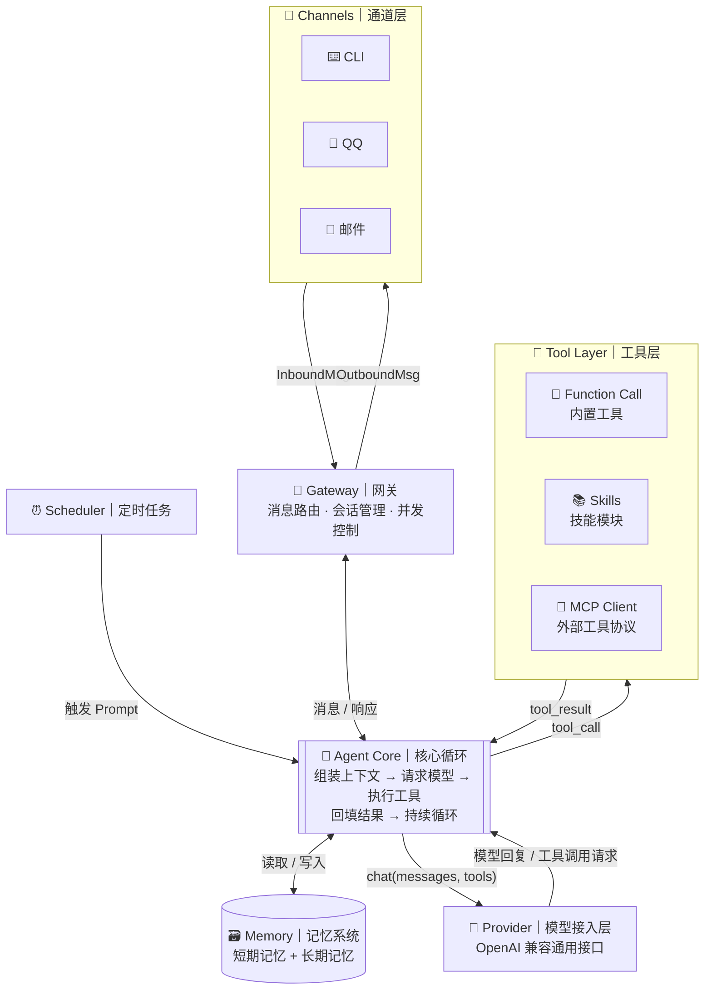
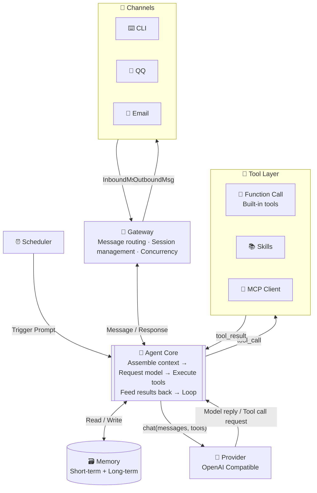

<div class="content-zh" markdown="1">

## 缘起：Agent 框架太重了，我的小服务器根本跑不动

我有一台 1GB 内存的 VPS，上面跑着几个小服务。我一直想在上面部署一个 AI Agent——让它帮我定时抓新闻、管理文件、收发邮件，甚至通过 QQ 跟我互动。

但现实很残酷。市面上的 Agent 框架，一个比一个重：

- **LangChain / LangGraph**：功能强大，但依赖链长得吓人。一个 Hello World 就要装几十个包，内存轻松上 500MB，还没算上 PostgreSQL 或 Redis。
- **CrewAI / AutoGPT**：多 Agent 协作看起来很酷，但启动一个实例就要 1GB+ 内存，我的 VPS 直接 OOM。
- **Dify / FastGPT**：它们更像是"平台"而不是"框架"——需要 Docker、需要数据库、需要前端，根本不是给 1GB 小服务器准备的。

更让我头疼的是，这些框架普遍有几个通病：

1. **配置太复杂**：环境变量 + YAML + 代码混在一起，换个模型要改三四个地方
2. **扩展工具门槛高**：想加一个自定义工具？先写 JSON Schema，再写适配器，再注册……一个简单的"读取文件"工具，光配置代码就要几十行
3. **只有 CLI 入口**：大部分框架只支持终端交互，想接到 QQ 或邮件？自己写适配器吧
4. **模型切换麻烦**：改环境变量、重启服务，完全没有"热切换"的概念

我想要的很简单：**一个能真正跑在 1GB 服务器上的 Agent，一个配置文件搞定一切，加工具像写 Python 函数一样简单。**

于是，**MiniSpark** 诞生了。

---

## MiniSpark 是什么

MiniSpark 是一个**面向低资源环境设计的轻量级 AI Agent 框架**，纯 Python 实现，零外部服务依赖。

核心理念就一句话：**让 LLM 变成一个能真正干活的小助手，而不是只能聊天。**

| | 常见 Agent 框架 | MiniSpark |
|---|---|---|
| 内存占用 | 500MB ~ 2GB+ | **< 100MB**（纯 Python，零外部服务） |
| 依赖 | PostgreSQL / Redis / Docker | **仅 SQLite**（单文件） |
| 配置方式 | 环境变量 + YAML + 代码 | **一个 config.toml** |
| 扩展工具 | 写 JSON Schema + 适配器 | **写一个 Python 函数 + 类型注解** |
| 模型切换 | 改环境变量，重启 | **`/model` 一键切换，API 自动发现** |
| 多通道 | 通常仅 CLI | **CLI / QQ / 邮件，三通道复用同一 Agent** |
| 启动时间 | 10 秒 ~ 1 分钟 | **< 3 秒** |

> 项目地址：[GitHub](https://github.com/mgl666/MiniSpark)

---

## 核心设计理念：Agent 循环 + 工具 + 记忆 + 定时任务

MiniSpark 不做"大而全"，而是把 Agent 框架最核心的四个能力做到极致：



**Agent Core** 是唯一的中枢。每一轮循环只做两件事：问模型"接下来做什么"（Provider），或者执行模型要求的工具（Tool Layer）。通道层只认识 `InboundMsg`/`OutboundMsg`，完全不关心 Agent 内部逻辑——新增一个平台就是新增一个 ~100 行的适配器。

---

## 功能一览

### 🧠 Agent 核心循环

这是 MiniSpark 的心脏，位于 `core/agent.py`，不到 300 行代码：

1. 用户消息进入 → 拼装 System Prompt（含技能目录 + 相关记忆）
2. 请求 LLM → 如果 LLM 返回"工具调用"
3. 并行执行所有工具调用（asyncio.gather）→ 结果回填给 LLM
4. 重复 2-3，直到 LLM 给出最终回复或达到最大轮数（默认 20 轮）

**安全机制：**
- 20 轮熔断保护，防止死循环
- 上下文溢出自动触发压缩，然后重试
- 工具报错时把错误文本回填给模型让它自行调整，不崩溃
- 单条工具结果截断（默认 ≤ 10K 字符），防止上下文爆炸

### 🧰 17 个内置工具

MiniSpark 内置了 6 组共 17 个工具，覆盖日常自动化场景：

| 模块 | 工具 | 说明 |
|------|------|------|
| `fs` | `read_file` `write_file` `append_file` `edit_file` `list_dir` | 本地文件管理，限制在配置的允许目录内 |
| `shell` | `run_shell` | Shell 命令执行，三级安全策略：白名单直通 / 默认需确认 / 黑名单拒绝 |
| `web` | `web_search` `web_fetch` | 网络搜索 + 网页抓取转 Markdown |
| `memory` | `memory_save` `memory_search` `memory_update` `memory_forget` | 长期记忆读写 |
| `schedule` | `schedule_task` `list_tasks` `cancel_task` | Agent 自己管理定时任务 |
| `email` | `send_email` | 邮件发送 |
| `skill` | `use_skill` | 按需加载技能（渐进式披露） |

**新增工具 = 写一个带类型注解的 Python 函数。** 框架借助 pydantic 自动生成 OpenAI 兼容的 JSON Schema，注册表自动完成注册。不需要写 JSON Schema，不需要写适配器——写一个函数，搞定。

### 📚 Skill 技能系统

Skill 是 MiniSpark 最具特色的扩展机制。一个技能 = 一个文件夹，里面放一个 `SKILL.md`：

```
~/.minispark/skills/daily-briefing/
├── SKILL.md          # frontmatter(name/description) + 操作指令正文
└── scripts/          # 可选：技能附带的脚本
```

**渐进式披露（Progressive Disclosure）**：启动时只注入所有技能的 `name + description` 摘要（几行字），当模型判断某任务匹配某技能时，调用 `use_skill` 工具按需加载完整正文。常驻上下文只占几行，不吃 token。

Skill 本质是 prompt，用户用自然语言就能写，扩展门槛最低。v1 随包内置了 6 个示例技能：每日简报、微博热搜、抖音热搜、B站热搜、同花顺头条、富途热搜。

### 🔌 MCP 协议支持

作为 MCP Client 连接任意 MCP Server（stdio / Streamable HTTP），远端工具自动注册为本地工具，与内置工具统一调度。配置文件里加几行就能接入 GitHub、文件系统、数据库等 MCP 生态工具。

### 🗃️ 记忆系统

- **短期记忆**：会话内历史，自动保存，超长自动压缩（摘要 + 硬截断双重兜底）
- **长期记忆**：SQLite FTS5 trigram 全文检索，模型主动调用 `memory_save` 持久化重要信息
- **零外部依赖**：单文件 SQLite（`minispark.db`），重启不丢，备份就是一个文件拷贝

借鉴了 Hermes Agent 的"主动式持久化"理念——System Prompt 指示模型在发现"值得记住的用户偏好/事实/约定"时主动调用记忆工具，而不是等用户说"记住……"。

### ⏰ 定时任务

对话中一句话创建："每天早上 8 点推送同花顺头条到 QQ"。APScheduler 驱动，SQLite 持久化，重启不丢。任务触发 = 以任务 prompt 为输入跑一次 Agent，输出通过 Gateway 推送到绑定通道。

### 📨 多通道

- **CLI**：终端交互，开发调试必备。支持 `/model` 一键切换模型（API 自动发现可用模型列表）、`/new` 开新会话、`/compact` 压缩上下文等 12 个会话命令
- **QQ**：腾讯官方 Bot API，纯 HTTP 调用，零额外进程，1GB 服务器即可胜任
- **邮件**：SMTP 发件 + IMAP 收件，支持发邮件给 Agent 下达指令，适合离线任务提交和定时简报推送

---

## 快速上手

```bash
# 1. 安装
cd MiniSpark
pip install -e .

# 2. 配置 — 只改一个文件
#    在 config.toml 中填入 API Key
[provider]
base_url = "https://api.deepseek.com/v1"
model = "deepseek-chat"
api_key = "sk-your-key"

# 3. 启动 CLI 对话
python -m minispark chat
```

```
你: 帮我写一个 Python 脚本，每小时抓一次天气并保存到 weather.csv
MiniSpark: （调用 write_file、schedule_task）
           ✅ 已创建 weather_fetcher.py + 定时任务（每小时执行）
```

---

## 技术选型：刻意做减法

MiniSpark 的哲学是"用最少的代码做最多的事"：

| 模块 | 代码量 | 说明 |
|------|:------:|------|
| core/ | ~800 行 | Agent 循环 + 上下文组装 + 会话管理 + 压缩 |
| providers/ | ~300 行 | 唯一实现：OpenAI 兼容通用接口 |
| tools/ | ~1600 行 | 内置工具 + Skill + MCP |
| memory/ | ~500 行 | SQLite 存储 + FTS5 检索 |
| channels/ | ~1000 行 | CLI + QQ + 邮件 |
| gateway + scheduler | ~500 行 | 消息路由 + 定时调度 |
| cli + config | ~600 行 | 命令入口 + pydantic 配置校验 |
| **合计** | **~5500 行** | |

**为什么不用 LangChain？** LangChain 是一个优秀的框架，但它的抽象层次太多，依赖链太长。MiniSpark 的 Agent 循环只需要 300 行纯 Python——引入一个框架，换来的是"轻量 + 可读"核心价值的丧失。

**为什么不用 LiteLLM？** LiteLLM 功能全但依赖重，与轻量目标冲突。MiniSpark 的 Provider 层只用了 `openai` SDK 指向任意 base_url——OpenAI 兼容协议已是事实标准，这一份代码即覆盖 OpenAI、DeepSeek、Kimi、通义、智谱、vLLM、Ollama 等几乎所有端点。

**为什么是 SQLite 而不是 PostgreSQL？** 因为 MiniSpark 的目标是"能在 1GB 服务器上跑"。SQLite 零配置、零进程、单文件，备份就是一个 `cp`。FTS5 全文检索对于个人 Agent 的记忆检索场景完全够用。

---

## 下载与安装

### 环境要求

- Python 3.11+
- < 100MB 可用内存
- 零外部服务依赖

### 安装

```bash
git clone https://github.com/mgl666/MiniSpark.git
cd MiniSpark
pip install -e .
```

### 配置

```bash
cp config.example.toml config.toml
# 编辑 config.toml，填入你的 API Key 和通道配置
```

### 启动

```bash
python -m minispark chat          # CLI 对话模式
python -m minispark serve         # 启动全部通道（CLI + QQ + 邮件 + 定时任务）
```

---

## 与 aiapiport 的配合：完美的 Agent 基础设施

如果你看过我之前写的 [aiapiport](https://github.com/mgl666/aiapiport)，会发现 MiniSpark 和 aiapiport 是天生一对：

```
aiapiport（API 网关）            MiniSpark（Agent 框架）
       │                              │
       │  统一管理所有 API Key         │  调用 LLM 干活
       │  主备自动 fallback            │  执行工具、管理记忆
       │  model → provider 路由        │  定时任务、多通道交互
       │                              │
       └──────────┬───────────────────┘
                  │
            在 config.toml 中：
            [provider]
            base_url = "http://localhost:8787/v1"
            api_key = "sk-你的网关密钥"
```

aiapiport 负责"把 API 管好"，MiniSpark 负责"用 API 干活"。一个管入口，一个管执行，各司其职。

---

## 许可

MiniSpark 采用 **MIT License**，可以自由使用、修改和分发。

---

## 最后

从"想在小服务器上跑一个 Agent"到"写一个能跑 Agent 的框架"，MiniSpark 花了很长时间打磨。

它不够大，但够轻——不到 100MB 内存，一个配置文件，三秒启动。它不够全，但够用——17 个内置工具，三种通道，Agent 循环、记忆、定时任务、Skill 系统，该有的都有。

如果你也有一台小服务器，想在上面跑一个真正能干活的 AI 助手，试试看。

</div>

<div class="content-en" markdown="1">

## The Pain Point: Agent Frameworks Are Too Heavy for My Tiny Server

I have a VPS with just 1GB of RAM, running a few small services. I've always wanted to deploy an AI Agent on it — to periodically fetch news, manage files, send and receive emails, even interact with me via QQ.

But reality is brutal. The Agent frameworks on the market are all heavyweight:

- **LangChain / LangGraph**: Powerful, but the dependency chain is terrifying. A Hello World requires dozens of packages, memory easily exceeds 500MB, and that's before adding PostgreSQL or Redis.
- **CrewAI / AutoGPT**: Multi-agent collaboration looks cool, but launching a single instance takes 1GB+ of RAM. My VPS goes straight to OOM.
- **Dify / FastGPT**: They're more like "platforms" than "frameworks" — they need Docker, databases, frontends. Definitely not built for a 1GB tiny server.

What frustrates me even more is that these frameworks share several common problems:

1. **Complex configuration**: Environment variables + YAML + code all mixed together. Changing a model requires editing three or four places.
2. **High barrier to adding tools**: Want to add a custom tool? Write JSON Schema first, then an adapter, then register it... A simple "read file" tool takes dozens of lines of boilerplate.
3. **CLI only**: Most frameworks only support terminal interaction. Want to connect to QQ or email? Write your own adapter.
4. **Painful model switching**: Edit environment variables, restart the service. No concept of "hot-swap" at all.

What I wanted was simple: **an Agent that actually runs on a 1GB server, controlled by a single config file, where adding tools is as easy as writing a Python function.**

And so, **MiniSpark** was born.

---

## What is MiniSpark

MiniSpark is a **lightweight AI Agent framework designed for low-resource environments**, pure Python implementation, zero external service dependencies.

The core philosophy in one sentence: **Turn LLMs into real assistants that get things done, not just chatbots.**

| | Typical Agent Frameworks | MiniSpark |
|---|---|---|
| RAM Usage | 500MB ~ 2GB+ | **< 100MB** (pure Python, zero external services) |
| Dependencies | PostgreSQL / Redis / Docker | **SQLite only** (single file) |
| Configuration | env vars + YAML + code | **One config.toml** |
| Adding Tools | Write JSON Schema + adapter | **Write a Python function with type hints** |
| Model Switching | Edit env vars, restart | **`/model` — one command, API auto-discovery** |
| Multi-Channel | Usually CLI only | **CLI / QQ / Email — one Agent, three channels** |
| Startup Time | 10s ~ 1min | **< 3 seconds** |

> Project link: [GitHub](https://github.com/mgl666/MiniSpark)

---

## Core Design Philosophy: Agent Loop + Tools + Memory + Scheduled Tasks

MiniSpark doesn't try to do everything. Instead, it focuses on perfecting the four core capabilities of an Agent framework:



**Agent Core** is the single hub. Each loop iteration does only two things: ask the model "what to do next" (Provider), or execute the tools the model requested (Tool Layer). The channel layer only knows `InboundMsg`/`OutboundMsg` — it has zero awareness of the Agent's internal logic. Adding a new platform = adding a ~100-line adapter file.

---

## Feature Overview

### 🧠 Agent Core Loop

This is the heart of MiniSpark, located in `core/agent.py`, under 300 lines of code:

1. User message arrives → assemble System Prompt (with skill catalog + relevant memories)
2. Request LLM → if LLM returns "tool calls"
3. Execute all tool calls in parallel (asyncio.gather) → feed results back to LLM
4. Repeat 2-3 until LLM gives a final response or max turns reached (default 20)

**Safety mechanisms:**
- 20-turn circuit breaker to prevent infinite loops
- Context overflow auto-triggers compaction, then retries
- Tool errors are fed back to the model as text for self-correction — no crashes
- Single tool result truncation (default ≤ 10K chars) to prevent context explosion

### 🧰 17 Built-in Tools

MiniSpark comes with 6 groups totaling 17 tools, covering everyday automation scenarios:

| Module | Tools | Description |
|--------|-------|-------------|
| `fs` | `read_file` `write_file` `append_file` `edit_file` `list_dir` | File management, restricted to configured allowed directories |
| `shell` | `run_shell` | Shell execution, 3-tier security: whitelist passthrough / default confirm / blacklist deny |
| `web` | `web_search` `web_fetch` | Web search + page fetch to Markdown |
| `memory` | `memory_save` `memory_search` `memory_update` `memory_forget` | Long-term memory CRUD |
| `schedule` | `schedule_task` `list_tasks` `cancel_task` | Agent self-manages scheduled tasks |
| `email` | `send_email` | Send emails |
| `skill` | `use_skill` | On-demand skill loading (progressive disclosure) |

**Adding a new tool = writing a Python function with type hints.** The framework uses pydantic to auto-generate OpenAI-compatible JSON Schema, and the registry auto-completes registration. No JSON Schema, no adapter — just write a function.

### 📚 Skills System

Skills are MiniSpark's most distinctive extension mechanism. One skill = one folder with a `SKILL.md`:

```
~/.minispark/skills/daily-briefing/
├── SKILL.md          # frontmatter(name/description) + instruction body
└── scripts/          # optional: scripts accompanying the skill
```

**Progressive Disclosure**: At startup, only the `name + description` summary of all skills is injected (a few lines). When the model determines a task matches a skill, it calls `use_skill` to load the full body on demand. The resident context is just a few lines — no token waste.

Skills are essentially prompts. Users can write them in natural language — the lowest possible extension barrier. v1 ships with 6 example skills: daily briefing, Weibo hot topics, Douyin hot topics, Bilibili hot topics, THS news headlines, and Futu news headlines.

### 🔌 MCP Protocol Support

Acts as an MCP Client connecting to any MCP Server (stdio / Streamable HTTP). Remote tools auto-register as local tools, unified with built-in tools. Add a few lines in the config to access GitHub, filesystem, databases, and other MCP ecosystem tools.

### 🗃️ Memory System

- **Short-term memory**: Session history, auto-saved, auto-compacted when too long (summary + hard truncation dual fallback)
- **Long-term memory**: SQLite FTS5 trigram full-text search, model proactively calls `memory_save` to persist important information
- **Zero external dependencies**: Single SQLite file (`minispark.db`), survives restarts, backup is a single `cp`

Inspired by Hermes Agent's "proactive persistence" philosophy — the System Prompt instructs the model to actively call memory tools when it discovers "user preferences/facts/agreements worth remembering," rather than waiting for the user to say "remember..."

### ⏰ Scheduled Tasks

Create a task in one sentence: "Push THS news headlines to my QQ every morning at 8 AM." Driven by APScheduler, persisted in SQLite, survives restarts. Task trigger = run the Agent once with the task prompt as input, output pushed to the bound channel via Gateway.

### 📨 Multi-Channel

- **CLI**: Terminal interaction, essential for development and debugging. Supports 12 session commands including `/model` one-click model switching (API auto-discovers available models), `/new` to start a new session, `/compact` to compress context
- **QQ**: Tencent official Bot API, pure HTTP, zero extra processes, runs on a 1GB server
- **Email**: SMTP sending + IMAP receiving, supports sending emails to the Agent to give instructions, ideal for offline task submission and scheduled briefing delivery

---

## Quick Start

```bash
# 1. Install
cd MiniSpark
pip install -e .

# 2. Configure — just edit one file
#    Fill in your API key in config.toml
[provider]
base_url = "https://api.deepseek.com/v1"
model = "deepseek-chat"
api_key = "sk-your-key"

# 3. Start CLI chat
python -m minispark chat
```

```
You: Write a Python script to fetch weather every hour and save to weather.csv
MiniSpark: (calls write_file, schedule_task)
           ✅ Created weather_fetcher.py + scheduled task (hourly)
```

---

## Technology Choice: Intentional Subtraction

MiniSpark's philosophy is "do the most with the least code":

| Module | Lines | Description |
|--------|:-----:|-------------|
| core/ | ~800 | Agent loop + context assembly + session management + compaction |
| providers/ | ~300 | Single implementation: OpenAI-compatible universal interface |
| tools/ | ~1600 | Built-in tools + Skill + MCP |
| memory/ | ~500 | SQLite storage + FTS5 search |
| channels/ | ~1000 | CLI + QQ + Email |
| gateway + scheduler | ~500 | Message routing + scheduled dispatch |
| cli + config | ~600 | Command entry + pydantic config validation |
| **Total** | **~5,500** | |

**Why not LangChain?** LangChain is an excellent framework, but it has too many abstraction layers and too long a dependency chain. MiniSpark's Agent loop only needs 300 lines of pure Python — introducing a framework would mean losing the core value of "lightweight + readable."

**Why not LiteLLM?** LiteLLM is feature-rich but dependency-heavy, conflicting with the lightweight goal. MiniSpark's Provider layer only uses the `openai` SDK pointed at any base_url — the OpenAI-compatible protocol is already the de facto standard, and this single implementation covers almost all endpoints: OpenAI, DeepSeek, Kimi, Tongyi, Zhipu, vLLM, Ollama, and more.

**Why SQLite instead of PostgreSQL?** Because MiniSpark's goal is "runs on a 1GB server." SQLite is zero-config, zero-process, single-file — backup is a single `cp`. FTS5 full-text search is perfectly adequate for personal Agent memory retrieval scenarios.

---

## Download & Installation

### Requirements

- Python 3.11+
- < 100MB available RAM
- Zero external service dependencies

### Install

```bash
git clone https://github.com/mgl666/MiniSpark.git
cd MiniSpark
pip install -e .
```

### Configure

```bash
cp config.example.toml config.toml
# Edit config.toml, fill in your API Key and channel settings
```

### Start

```bash
python -m minispark chat          # CLI chat mode
python -m minispark serve         # Start all channels (CLI + QQ + Email + Scheduler)
```

---

## Pairing with aiapiport: The Perfect Agent Infrastructure

If you've read my previous post about [aiapiport](https://github.com/mgl666/aiapiport), you'll see that MiniSpark and aiapiport are a match made in heaven:

```
aiapiport (API Gateway)           MiniSpark (Agent Framework)
       │                              │
       │  Unified API Key management  │  Uses LLMs to get things done
       │  Primary/backup fallback     │  Executes tools, manages memory
       │  model → provider routing    │  Scheduled tasks, multi-channel
       │                              │
       └──────────┬───────────────────┘
                  │
            In config.toml:
            [provider]
            base_url = "http://localhost:8787/v1"
            api_key = "sk-your-gateway-key"
```

aiapiport handles "managing the APIs well," while MiniSpark handles "using the APIs to get things done." One manages the entrance, one manages the execution — each doing what it does best.

---

## License

MiniSpark is licensed under the **MIT License**, free to use, modify, and distribute.

---

## Final Words

From "I want to run an Agent on my tiny server" to "I'll write a framework that can run an Agent," MiniSpark has been carefully polished over a long time.

It's not big, but it's light — under 100MB memory, one config file, three-second startup. It's not everything, but it's enough — 17 built-in tools, three channels, Agent loop, memory, scheduled tasks, skills system — everything you need.

If you also have a tiny server and want to run a truly capable AI assistant on it, give it a try.

</div>