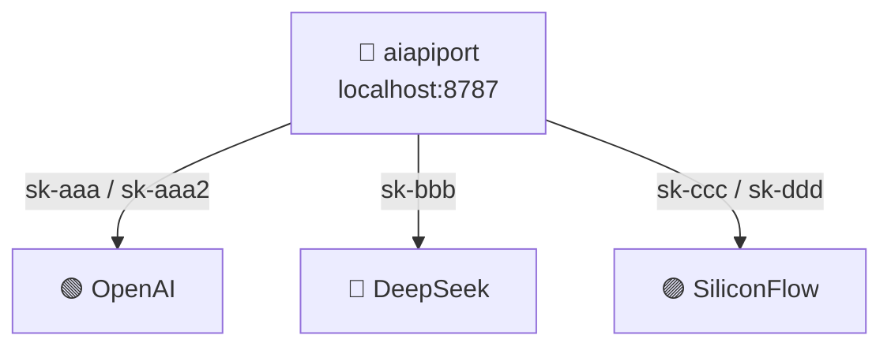
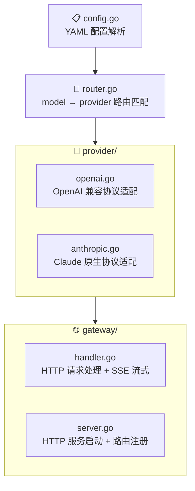
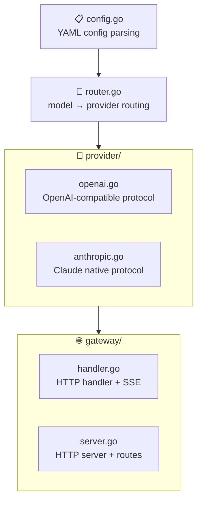

<div class="content-zh" markdown="1">

## 缘起：多个大模型调用的关键痛点

如果你和我一样重度使用各种 LLM，那你大概率面临这样一个问题：

**API Key 太多了。**

- OpenAI 官方的、DeepSeek 官方的、Anthropic 官方的……
- 一堆中转站：OpenRouter、SiliconFlow、n1n.ai……每个中转站又有自己的 Key
- 每个平台还不止一个 Key——主 Key 额度用完了要切备用 Key，不同模型可能对应不同 Key

于是我的日常变成了：

1. 在某个客户端里填 OpenAI 的 Key，配置 DeepSeek 的 Key
2. 换一个客户端，又要重新填一遍
3. 某个 Key 额度用完了，手忙脚乱地一个个替换
4. 想加一个备用中转站，所有客户端又要改一遍
5. 不同客户端对 Key 的格式要求还不一样，有的要 `/v1` 后缀，有的不要

十几个 Key，散落在各个客户端、各个配置文件里。管理起来像打地鼠——这边刚改完，那边又出问题。

**我需要一个中间层。** 一个统一的入口，把所有的 Key 都交给它，客户端只认这一个入口。切换 Key、切换模型、fallback 这些事情，全部由它来处理。

市面上不是没有这样的工具。LiteLLM 是最知名的，但它是一个 Python 项目，空闲内存就要吃掉 ~200 MB。我的 VPS 只有 1 GB 内存，跑一个网关就占 200 MB，太奢侈了。

于是，**aiapiport** 诞生了。

---

## aiapiport 是什么

aiapiport 是一个**用 Go 编写的极简 LLM API 网关**，核心功能就一句话：

> **把多个上游 Provider 和 Key 聚合为一个单一的 OpenAI 兼容端点。**

- 空闲内存仅 **~12 MB**（对比 LiteLLM 的 ~200 MB）
- 单个二进制文件，无需 Python 环境、无需 pip install
- 暴露标准的 `/v1/chat/completions` 接口，兼容所有 OpenAI 生态的客户端
- 支持主备 Key 自动 fallback（429/5xx/401 时自动切换）

> 项目地址：[GitHub](https://github.com/mgl666/aiapiport)

---

## 核心设计理念：一端聚合，全局统一

aiapiport 的设计哲学非常直接：



**所有客户端只认一个地址：`http://localhost:8787/v1`**。背后是 OpenAI 还是 DeepSeek 还是某个中转站，客户端完全不用关心。你只需要在 aiapiport 的配置文件里维护好 Key 和路由规则。

---

## 功能一览

### 🔑 多 Provider 聚合

支持两类上游：

- **OpenAI 兼容**：OpenAI、DeepSeek、Moonshot、SiliconFlow、各种中转站（只要提供 OpenAI 兼容接口，统统支持）
- **Anthropic 直连**：Claude 原生 API 直连

每个 Provider 可以配置多个 Key，第一个为主 Key，其余的为备用。当主 Key 遇到 429（限流）、5xx（服务端错误）或 401（鉴权过期）时，自动切换到下一个 Key。

### 🧭 模型路由

通过 `routes` 配置，将客户端请求的模型名映射到对应的 Provider：

```yaml
routes:
  "gpt-4o":          openai
  "deepseek-chat":   deepseek
  "claude-opus-5":   anthropic
```

客户端请求 `gpt-4o` → 自动走 OpenAI；请求 `deepseek-chat` → 自动走 DeepSeek。对客户端来说，只需要记住一个 base_url，模型名不变。

### ⚡ SSE 流式输出

完整支持 SSE（Server-Sent Events）流式输出，与 OpenAI 的 `stream: true` 行为一致。不管你用 ChatBox、NextChat、LobeChat、还是 Python SDK，流式体验和直连 OpenAI 一样。

### 🛡️ 网关鉴权

aiapiport 自身也有一层鉴权——所有客户端请求必须携带网关的 `auth_key`，防止未授权的请求穿透到上游。

### 📦 极简部署

- **单文件二进制**：编译产物仅一个可执行文件，拷贝到服务器就能跑
- **支持后台运行**：`aiapiport start` 后台启动，`aiapiport stop` 停止，`aiapiport logs` 查看日志
- **支持 systemd**：提供 systemd service 文件，适合 VPS 长期运行
- **一键安装**：`curl -fsSL https://raw.githubusercontent.com/mgl666/aiapiport/main/install.sh | sh`

---

## 快速上手

### 1. 安装

```bash
curl -fsSL https://raw.githubusercontent.com/mgl666/aiapiport/main/install.sh | sh
```

### 2. 配置

```bash
cp config.yaml.example config.yaml
```

编辑 `config.yaml`：

```yaml
server:
  listen: ":8787"
  auth_key: "sk-你的网关密钥"

providers:
  - name: openai
    base_url: "https://api.openai.com/v1"
    type: openai
    keys:
      - "sk-主key"
      - "sk-备用key"

  - name: deepseek
    base_url: "https://api.deepseek.com/v1"
    type: openai
    keys:
      - "sk-deepseek-key"

  - name: siliconflow
    base_url: "https://api.siliconflow.cn/v1"
    type: openai
    keys:
      - "sk-中转站key1"
      - "sk-中转站key2"

routes:
  "gpt-4o":          openai
  "deepseek-chat":   deepseek
  "claude-sonnet-5": siliconflow
```

### 3. 启动

```bash
aiapiport start
```

### 4. 接入客户端

所有客户端只需填写一个地址：

| 客户端 | 配置 |
|--------|------|
| ChatBox / NextChat / LobeChat | API 地址：`http://localhost:8787/v1`，Key：`sk-你的网关密钥` |
| OpenAI Python SDK | `base_url="http://localhost:8787/v1"`，`api_key="sk-你的网关密钥"` |
| Cursor / 兼容 OpenAI 的编辑器 | `http://localhost:8787/v1` |

---

## 技术选型：为什么是 Go

选择 Go 而非 Python 来写这个网关，核心原因只有两个：

| 指标 | aiapiport (Go) | LiteLLM (Python) |
|------|---------------|-------------------|
| 空闲内存 | ~12 MB | ~200 MB |
| 部署方式 | 单文件二进制 | pip install + 依赖 |
| 启动速度 | 毫秒级 | 秒级 |

Go 的编译产物是静态链接的单一二进制文件，不依赖任何运行时环境。对于 VPS 这种资源紧张的场景，Go 几乎是唯一选择。

整体架构非常简单：



---

## 功能范围：刻意做减法

aiapiport 不是一个"大而全"的网关。它刻意不做这些事情：

| 功能 | 支持 | 说明 |
|------|:----:|------|
| OpenAI 及兼容上游 | ✅ | DeepSeek、Moonshot、SiliconFlow、各种中转站 |
| Anthropic Claude 直连 | ✅ | 原生协议适配 |
| 中转站 Claude（OpenAI 格式） | ✅ | 经 relay 中转的 Claude 也支持 |
| SSE 流式输出 | ✅ | 与 OpenAI 行为一致 |
| 主备 Key 自动 fallback | ✅ | 429/5xx/401 时自动切换 |
| 网关鉴权 | ✅ | 自身 auth_key 保护 |
| model → provider 路由 | ✅ | 灵活配置映射 |
| 虚拟 Key / 用量统计 / 管理后台 | ❌ | 需要更强功能请用 LiteLLM |

这不是功能缺失，是**刻意取舍**。如果你需要用量统计、用户管理、多租户等企业级功能，LiteLLM 是更好的选择。如果你只需要一个轻量、稳定、省资源的 API 聚合层，aiapiport 就是为你准备的。

---

## 下载与安装

### 一键安装（Linux/macOS）

```bash
curl -fsSL https://raw.githubusercontent.com/mgl666/aiapiport/main/install.sh | sh
```

### 从 GitHub Releases 下载

前往 [GitHub Releases](https://github.com/mgl666/aiapiport/releases) 下载对应平台的二进制文件，直接运行即可。

### 从源码编译

```bash
git clone https://github.com/mgl666/aiapiport.git
cd aiapiport
go build -ldflags "-s -w" -trimpath -o aiapiport .
```

### VPS 部署（systemd）

```bash
GOOS=linux GOARCH=amd64 CGO_ENABLED=0 go build -ldflags "-s -w" -trimpath -o aiapiport .
scp aiapiport root@vps:/usr/local/bin/aiapiport-bin
scp config.yaml root@vps:/etc/aiapiport/config.yaml
scp litellm-go.service root@vps:/etc/systemd/system/aiapiport.service
ssh root@vps "systemctl daemon-reload && systemctl enable --now aiapiport"
```

---

## 许可

aiapiport 采用 **MIT License**，可以自由使用、修改和分发。

---

## 最后

从十几个 Key 散落在各处，到一个统一的 `localhost:8787/v1`，aiapiport 解决的是一个很具体、很实际的痛点。

它很小——12 MB 内存，单文件二进制，毫秒级启动。但它很实用——从此以后，你再也不用在每个客户端里反复填 Key 了。

如果你也有类似的困扰，试试看。

</div>

<div class="content-en" markdown="1">

## The Pain Point: More Keys Than Your Keychain

If you're a heavy LLM user like me, you're probably facing the same problem:

**Too many API Keys.**

- Official ones from OpenAI, DeepSeek, Anthropic...
- A bunch of relay stations: OpenRouter, SiliconFlow, n1n.ai... each with its own Key
- And each platform doesn't just have one Key — primary key runs out of quota, switch to backup; different models might need different Keys

So my daily routine became:

1. Fill in OpenAI's Key in one client, configure DeepSeek's Key in another
2. Switch to a different client, fill everything in again
3. A Key runs out of quota, frantically replace them one by one
4. Want to add a backup relay station, need to update all clients again
5. Different clients have different Key format requirements — some need `/v1` suffix, some don't

A dozen keys scattered across various clients and config files. Managing them feels like playing whack-a-mole — you fix one thing here, another breaks over there.

**I needed a middle layer.** A unified entry point where I hand over all my Keys, and clients only talk to this one endpoint. Switching Keys, switching models, fallback — all handled by this layer.

It's not that such tools don't exist. LiteLLM is the most well-known one, but it's a Python project that eats up ~200 MB of memory just sitting idle. My VPS only has 1 GB of RAM — spending 200 MB on a gateway is too extravagant.

And so, **aiapiport** was born.

---

## What is aiapiport

aiapiport is a **minimal LLM API gateway written in Go**. Its core functionality can be summed up in one sentence:

> **Aggregate multiple upstream providers and keys into a single OpenAI-compatible endpoint.**

- Idle memory: only **~12 MB** (vs ~200 MB for LiteLLM)
- Single binary file, no Python environment needed, no pip install
- Exposes a standard `/v1/chat/completions` endpoint, compatible with all OpenAI ecosystem clients
- Automatic primary/backup Key fallback (on 429/5xx/401)

> Project link: [GitHub](https://github.com/mgl666/aiapiport)

---

## Core Design Philosophy: One Endpoint, Global Unification

aiapiport's design philosophy is straightforward:


**All clients only know one address: `http://localhost:8787/v1`.** Whether it's OpenAI, DeepSeek, or some relay station behind the scenes — the client doesn't need to care. You just maintain the Keys and routing rules in aiapiport's config file.

---

## Feature Overview

### 🔑 Multi-Provider Aggregation

Supports two types of upstream:

- **OpenAI-compatible**: OpenAI, DeepSeek, Moonshot, SiliconFlow, and any relay station (as long as it provides an OpenAI-compatible interface, it's supported)
- **Anthropic direct**: Claude native API direct connection

Each provider can be configured with multiple Keys. The first is the primary, the rest are backups. When the primary encounters 429 (rate limit), 5xx (server error), or 401 (auth expired), it automatically switches to the next Key.

### 🧭 Model Routing

Through the `routes` configuration, map the model name from client requests to the corresponding provider:

```yaml
routes:
  "gpt-4o":          openai
  "deepseek-chat":   deepseek
  "claude-opus-5":   anthropic
```

Client requests `gpt-4o` → automatically routed to OpenAI; requests `deepseek-chat` → automatically routed to DeepSeek. From the client's perspective, you only need to remember one base_url, and the model names stay the same.

### ⚡ SSE Streaming

Full support for SSE (Server-Sent Events) streaming, consistent with OpenAI's `stream: true` behavior. Whether you use ChatBox, NextChat, LobeChat, or the Python SDK, the streaming experience is identical to connecting directly to OpenAI.

### 🛡️ Gateway Authentication

aiapiport itself has a layer of authentication — all client requests must carry the gateway's `auth_key`, preventing unauthorized requests from reaching upstream.

### 📦 Minimal Deployment

- **Single binary**: The compiled output is just one executable file. Copy it to your server and run it.
- **Background daemon**: `aiapiport start` to run in background, `aiapiport stop` to stop, `aiapiport logs` to view logs
- **systemd support**: Includes a systemd service file, ideal for long-running VPS deployments
- **One-line install**: `curl -fsSL https://raw.githubusercontent.com/mgl666/aiapiport/main/install.sh | sh`

---

## Quick Start

### 1. Install

```bash
curl -fsSL https://raw.githubusercontent.com/mgl666/aiapiport/main/install.sh | sh
```

### 2. Configure

```bash
cp config.yaml.example config.yaml
```

Edit `config.yaml`:

```yaml
server:
  listen: ":8787"
  auth_key: "sk-your-gateway-key"

providers:
  - name: openai
    base_url: "https://api.openai.com/v1"
    type: openai
    keys:
      - "sk-primary-key"
      - "sk-backup-key"

  - name: deepseek
    base_url: "https://api.deepseek.com/v1"
    type: openai
    keys:
      - "sk-deepseek-key"

  - name: siliconflow
    base_url: "https://api.siliconflow.cn/v1"
    type: openai
    keys:
      - "sk-relay-key1"
      - "sk-relay-key2"

routes:
  "gpt-4o":          openai
  "deepseek-chat":   deepseek
  "claude-sonnet-5": siliconflow
```

### 3. Start

```bash
aiapiport start
```

### 4. Connect Clients

All clients only need to fill in one address:

| Client | Configuration |
|--------|---------------|
| ChatBox / NextChat / LobeChat | API URL: `http://localhost:8787/v1`, Key: `sk-your-gateway-key` |
| OpenAI Python SDK | `base_url="http://localhost:8787/v1"`, `api_key="sk-your-gateway-key"` |
| Cursor / OpenAI-compatible editors | `http://localhost:8787/v1` |

---

## Technology Choice: Why Go

The choice of Go over Python for this gateway comes down to two core reasons:

| Metric | aiapiport (Go) | LiteLLM (Python) |
|--------|---------------|-------------------|
| Idle Memory | ~12 MB | ~200 MB |
| Deployment | Single binary | pip install + dependencies |
| Startup Time | Milliseconds | Seconds |

Go's compiled output is a statically linked single binary with no runtime dependencies. For resource-constrained environments like VPS, Go is almost the only sensible choice.

The overall architecture is very simple:



---

## Feature Scope: Intentional Subtraction

aiapiport is not a "do-everything" gateway. It deliberately does NOT do these things:

| Feature | Support | Note |
|---------|:-------:|------|
| OpenAI & compatible upstreams | ✅ | DeepSeek, Moonshot, SiliconFlow, relay stations |
| Anthropic Claude (direct) | ✅ | Native protocol adaptation |
| Claude via relay (OpenAI format) | ✅ | Also supported |
| SSE streaming | ✅ | Consistent with OpenAI behavior |
| Primary/backup Key fallback | ✅ | Auto-switch on 429/5xx/401 |
| Gateway auth | ✅ | Self auth_key protection |
| model → provider routing | ✅ | Flexible mapping |
| Virtual Keys / Usage stats / Admin UI | ❌ | Use LiteLLM for advanced features |

This isn't a lack of features — it's **intentional curation**. If you need usage statistics, user management, multi-tenancy, and other enterprise features, LiteLLM is the better choice. If you just need a lightweight, stable, resource-efficient API aggregation layer, aiapiport is built for you.

---

## Download & Installation

### One-Line Install (Linux/macOS)

```bash
curl -fsSL https://raw.githubusercontent.com/mgl666/aiapiport/main/install.sh | sh
```

### From GitHub Releases

Visit [GitHub Releases](https://github.com/mgl666/aiapiport/releases) to download the binary for your platform and run it directly.

### Build from Source

```bash
git clone https://github.com/mgl666/aiapiport.git
cd aiapiport
go build -ldflags "-s -w" -trimpath -o aiapiport .
```

### VPS Deployment (systemd)

```bash
GOOS=linux GOARCH=amd64 CGO_ENABLED=0 go build -ldflags "-s -w" -trimpath -o aiapiport .
scp aiapiport root@vps:/usr/local/bin/aiapiport-bin
scp config.yaml root@vps:/etc/aiapiport/config.yaml
scp litellm-go.service root@vps:/etc/systemd/system/aiapiport.service
ssh root@vps "systemctl daemon-reload && systemctl enable --now aiapiport"
```

---

## License

aiapiport is licensed under the **MIT License**, free to use, modify, and distribute.

---

## Final Words

From a dozen Keys scattered everywhere to a single `localhost:8787/v1`, aiapiport solves a very specific, very real pain point.

It's tiny — 12 MB memory, single binary, millisecond startup. But it's practical — from now on, you never have to repeatedly fill in Keys across every client again.

If you have the same struggle, give it a try.

</div>